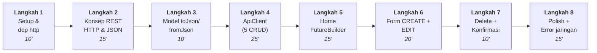
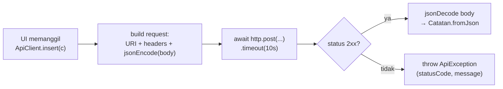

# Praktikum Pertemuan 5 — REST API & CRUD Jaringan (HTTP)

## Informasi Umum

| Item             | Keterangan                                                          |
| ---------------- | ------------------------------------------------------------------- |
| Pertemuan        | Minggu 5 (Lanjutan setelah SQLite/CRUD lokal)                       |
| Topik Kuliah     | REST, HTTP method, JSON, `package:http`, error jaringan             |
| Durasi Praktikum | 120 menit                                                           |
| Prasyarat        | Pertemuan 4 selesai (Async/Await, FutureBuilder, repository, Form Create/Edit) |

---

## Tujuan Praktikum

Setelah menyelesaikan praktikum ini, mahasiswa mampu:

1. Menjelaskan perbedaan persistensi **lokal** (SQLite) vs **remote** (REST API).
2. Memakai `package:http` untuk operasi `GET / POST / PUT / DELETE` ke server Laravel.
3. Serialisasi Dart object ↔ JSON lewat `toJson()` & `fromJson()`.
4. Mengirim **header kustom** (`X-API-Key`, `Content-Type`).
5. Menangani **3 kelas error jaringan**: timeout, tidak ada internet, HTTP 4xx/5xx.
6. Mengganti repository `DbHelper` (P4) dengan `ApiClient` **tanpa mengubah UI**.

> P4 menjawab: "Bagaimana data **tidak hilang** saat app ditutup?" — disimpan di disk.
> P5 menjawab: "Bagaimana data **bisa diakses dari banyak device**?" — disimpan di server.

---

## Yang Berubah dari Pertemuan 4

| Aspek                | Pertemuan 4 (SQLite)            | Pertemuan 5 (REST API)                       |
| -------------------- | ------------------------------- | -------------------------------------------- |
| Sumber data          | File lokal `catatan.db`         | Server Laravel (HTTPS)                       |
| Package              | `sqflite` + `path`              | **`http`**                                   |
| Repository           | `DbHelper`                      | **`ApiClient`** (signature method **sama**)  |
| Serialisasi          | `toMap()` int epoch             | `toJson()/fromJson()` ISO-8601 string        |
| Kecepatan akses      | Sangat cepat                    | Tergantung jaringan                          |
| Error mungkin        | DB locked (jarang)              | Timeout, no internet, 4xx/5xx                |
| Init binding         | `WidgetsFlutterBinding.ensureInitialized()` wajib | Tidak wajib (no platform channel) |
| UI / `main.dart`     | —                               | **Tidak berubah** kecuali nama repo          |

---

## Kontrak API (yang sudah disiapkan dosen)

Base URL: `https://besab-production.up.railway.app/api`
API key: `8f38b5fbf0bc437285f2c62ed6e447eab56f78c8f95239a7`
Semua request wajib header `X-API-Key: <api key di atas>`.

| Method | URL                  | Body                                          | Sukses                   | Error              |
|--------|----------------------|-----------------------------------------------|--------------------------|--------------------|
| GET    | `/catatan`           | —                                             | 200 `{success,data:[…]}` | 401                |
| GET    | `/catatan/{id}`      | —                                             | 200 `{success,data}`     | 404, 401           |
| POST   | `/catatan`           | `{judul,isi,kategori,dibuat_pada?}`           | 201 `{success,data}`     | 422, 401           |
| PUT    | `/catatan/{id}`      | `{judul,isi,kategori}`                        | 200 `{success,data}`     | 404, 422, 401      |
| DELETE | `/catatan/{id}`      | —                                             | 200 `{success,message}`  | 404, 401           |

Format `Catatan`:

```json
{
  "id": 7,
  "judul": "Tugas Mobile",
  "isi": "Selesaikan modul P5",
  "kategori": "Tugas",
  "dibuat_pada": "2026-06-02T10:30:00.000000Z"
}
```

---

## Alur Praktikum (8 Langkah, 120 menit)



---

## Langkah 1 — Setup Project (10 menit)

### 1.1 Clone repo materi & duplikasi dari Pertemuan 4

Kalau belum pernah clone repo materi praktikum:

```bash
git clone https://github.com/githubna-ilham/praktikum-sab.git
cd praktikum-sab
```

Lalu duplikasi Pertemuan 4 sebagai titik awal:

```bash
cp -r pertemuan-4 pertemuan-5
cd pertemuan-5
```

Generate folder native (sekali saja) & install paket:

```bash
flutter create .
flutter pub get
```

> 💡 Kita **refactor bertahap** dari kode P4 (SQLite) menjadi P5 (REST API), bukan mulai dari nol.

### 1.2 Ganti dependensi di `pubspec.yaml`

Hapus `sqflite` dan `path`, tambahkan `http`:

```yaml
dependencies:
  flutter:
    sdk: flutter
  cupertino_icons: ^1.0.8

  # === Baru di Pertemuan 5 ===
  http: ^1.2.0      # HTTP client resmi Dart
```

Lalu:

```bash
flutter pub get
```

### 1.3 Hapus file `lib/db_helper.dart`

P5 tidak butuh `DbHelper` lagi. Hapus file, lalu hapus import-nya di `lib/main.dart`.

### 1.4 Base URL & API key

Base URL & API key sudah ditentukan (lihat tabel kontrak API di atas). Kita akan pakai di Langkah 4.

### 1.5 Catatan emulator

| Platform                      | Base URL `localhost`         |
| ----------------------------- | ---------------------------- |
| Android emulator              | `http://10.0.2.2:8000`       |
| iOS simulator / desktop       | `http://127.0.0.1:8000`      |
| Production (Railway dll)      | `https://<domain>` langsung  |

> ⚠️ **Android & HTTP plain**: kalau dosen pakai server `http://` (bukan `https`), tambahkan `android:usesCleartextTraffic="true"` di `android/app/src/main/AndroidManifest.xml`. Untuk URL `https://` Railway, tidak perlu.

---

## Langkah 2 — Konsep REST, HTTP & JSON (15 menit)

### 2.1 Apa itu REST?

REST = gaya komunikasi client-server di mana **resource** (mis. "catatan") diakses lewat URL, dan **aksi** dinyatakan lewat HTTP method.

| Aksi (CRUD) | HTTP method | Contoh URL          |
| ----------- | ----------- | ------------------- |
| Read all    | `GET`       | `/api/catatan`      |
| Read one    | `GET`       | `/api/catatan/7`    |
| Create      | `POST`      | `/api/catatan`      |
| Update      | `PUT`       | `/api/catatan/7`    |
| Delete      | `DELETE`    | `/api/catatan/7`    |

### 2.2 Status code yang akan ditemui

| Code | Arti              | Kapan                                              |
| ---- | ----------------- | -------------------------------------------------- |
| 200  | OK                | GET / PUT / DELETE sukses                          |
| 201  | Created           | POST sukses                                        |
| 401  | Unauthorized      | API key salah / tidak dikirim                      |
| 404  | Not Found         | Resource id tidak ada                              |
| 422  | Unprocessable     | Validasi gagal (mis. judul kosong)                 |
| 5xx  | Server error      | Backend down / bug                                 |

### 2.3 JSON & parsing di Dart

JSON dari server adalah **string**. Dart mengubahnya jadi `Map<String, dynamic>`:

```dart
import 'dart:convert';

final body = '{"id":1,"judul":"X"}';
final Map<String, dynamic> map = jsonDecode(body);
print(map['judul']);  // X
```

Sebaliknya, untuk mengirim:

```dart
jsonEncode({'judul': 'X', 'isi': 'y'});  // -> '{"judul":"X","isi":"y"}'
```

---

## Langkah 3 — Refactor Model `Catatan` (10 menit)

Beda dgn P4: `toMap` & `fromMap` diganti `toJson` & `fromJson`, dan `dibuatPada` dikirim sebagai **ISO-8601 string** (bukan int epoch).

Ganti class `Catatan` di `lib/main.dart`:

```dart
class Catatan {
  final int? id;
  final String judul;
  final String isi;
  final String kategori;
  final DateTime dibuatPada;

  Catatan({
    this.id,
    required this.judul,
    required this.isi,
    required this.kategori,
    required this.dibuatPada,
  });

  Map<String, dynamic> toJson() => {
        if (id != null) 'id': id,
        'judul': judul,
        'isi': isi,
        'kategori': kategori,
        'dibuat_pada': dibuatPada.toUtc().toIso8601String(),
      };

  static Catatan fromJson(Map<String, dynamic> m) => Catatan(
        id: m['id'] as int?,
        judul: m['judul'] as String,
        isi: m['isi'] as String,
        kategori: m['kategori'] as String,
        dibuatPada: DateTime.parse(m['dibuat_pada'] as String),
      );

  Catatan copyWith({String? judul, String? isi, String? kategori}) =>
      Catatan(
        id: id,
        judul: judul ?? this.judul,
        isi: isi ?? this.isi,
        kategori: kategori ?? this.kategori,
        dibuatPada: dibuatPada,
      );
}
```

> 💡 **Kenapa ISO-8601 string?** Karena JSON tidak punya tipe `Date`. ISO-8601 (`2026-06-02T10:30:00Z`) adalah format universal yang dimengerti hampir semua bahasa & DB.

---

## Langkah 4 — `ApiClient` (Singleton + HTTP CRUD) (25 menit)

### 4.1 Buat file baru `lib/api_client.dart`

Pola sama dgn `DbHelper` di P4: **singleton** + method 1:1 untuk tiap operasi.

```dart
import 'dart:async';
import 'dart:convert';
import 'dart:io';
import 'package:http/http.dart' as http;
import 'main.dart' show Catatan;

class ApiException implements Exception {
  final int statusCode;
  final String message;
  ApiException(this.statusCode, this.message);
  @override
  String toString() => 'ApiException($statusCode): $message';
}

class ApiClient {
  ApiClient._();
  static final ApiClient instance = ApiClient._();

  // === Base URL & API key (lihat kontrak API di Langkah 0) ===
  static const String _baseUrl = 'https://besab-production.up.railway.app/api';
  static const String _apiKey  = '8f38b5fbf0bc437285f2c62ed6e447eab56f78c8f95239a7';
  // ==========================================================

  static const _timeout = Duration(seconds: 10);

  Map<String, String> get _headers => {
        'X-API-Key': _apiKey,
        'Content-Type': 'application/json',
        'Accept': 'application/json',
      };

  // ===== CRUD =====

  Future<List<Catatan>> getAll() async {
    final res = await _send(() => http.get(
          Uri.parse('$_baseUrl/catatan'),
          headers: _headers,
        ));
    final body = jsonDecode(res.body) as Map<String, dynamic>;
    final list = (body['data'] as List).cast<Map<String, dynamic>>();
    return list.map(Catatan.fromJson).toList();
  }

  Future<Catatan> getById(int id) async {
    final res = await _send(() => http.get(
          Uri.parse('$_baseUrl/catatan/$id'),
          headers: _headers,
        ));
    final body = jsonDecode(res.body) as Map<String, dynamic>;
    return Catatan.fromJson(body['data'] as Map<String, dynamic>);
  }

  Future<Catatan> insert(Catatan c) async {
    final res = await _send(() => http.post(
          Uri.parse('$_baseUrl/catatan'),
          headers: _headers,
          body: jsonEncode(c.toJson()),
        ));
    final body = jsonDecode(res.body) as Map<String, dynamic>;
    return Catatan.fromJson(body['data'] as Map<String, dynamic>);
  }

  Future<Catatan> update(Catatan c) async {
    assert(c.id != null);
    final res = await _send(() => http.put(
          Uri.parse('$_baseUrl/catatan/${c.id}'),
          headers: _headers,
          body: jsonEncode(c.toJson()),
        ));
    final body = jsonDecode(res.body) as Map<String, dynamic>;
    return Catatan.fromJson(body['data'] as Map<String, dynamic>);
  }

  Future<void> delete(int id) async {
    await _send(() => http.delete(
          Uri.parse('$_baseUrl/catatan/$id'),
          headers: _headers,
        ));
  }

  // ===== Helper: kirim + tangani 3 kelas error =====
  Future<http.Response> _send(Future<http.Response> Function() req) async {
    try {
      final res = await req().timeout(_timeout);
      if (res.statusCode >= 200 && res.statusCode < 300) return res;
      throw ApiException(res.statusCode, _extractMessage(res));
    } on SocketException {
      throw ApiException(0, 'Tidak ada koneksi internet.');
    } on TimeoutException {
      throw ApiException(0, 'Server tidak merespons (timeout).');
    }
  }

  String _extractMessage(http.Response res) {
    try {
      final m = jsonDecode(res.body) as Map<String, dynamic>;
      return (m['message'] as String?) ?? 'HTTP ${res.statusCode}';
    } catch (_) {
      return 'HTTP ${res.statusCode}';
    }
  }
}
```

### 4.2 Anatomi method



### 4.3 Anti-pattern yang harus dihindari

❌ **Hard-code URL di banyak tempat**: kalau base URL berubah, harus edit di banyak file.
✅ Simpan di **satu konstanta** `_baseUrl` di `ApiClient`.

❌ **Membungkus setiap call dengan `try/catch` di UI** dengan pesan generic:
✅ Lempar `ApiException` dari `ApiClient`, biar UI tampilkan `e.message` saja.

❌ **Lupa header `Content-Type: application/json`** di POST/PUT:
✅ Selalu pakai `_headers` getter agar konsisten.

---

## Langkah 5 — Home pakai `FutureBuilder` (15 menit)

> **Bagus banget**: kalau struktur P4 sudah betul, **kode Home tidak berubah** kecuali ganti `DbHelper` jadi `ApiClient`.

Di `_HomePageState`:

```dart
void _muatUlang() {
  setState(() {
    _futureCatatan = ApiClient.instance.getAll();   // <-- satu-satunya perubahan
  });
}
```

Bagian `FutureBuilder<List<Catatan>>` di `build()` **tetap sama persis** dengan P4:

- 3 state: `connectionState != done` (loading), `hasError` (error), data.
- Pola "refresh on return" setelah `Navigator.pushNamed('/form')` juga tetap sama.

Yang baru: `snapshot.hasError` sekarang bisa menampilkan pesan dari `ApiException`. Pertajam tampilannya:

```dart
if (snapshot.hasError) {
  final e = snapshot.error;
  final pesan = e is ApiException ? e.message : 'Terjadi kesalahan: $e';
  return Center(
    child: Column(
      mainAxisAlignment: MainAxisAlignment.center,
      children: [
        const Icon(Icons.error_outline, size: 48),
        const SizedBox(height: 8),
        Text(pesan, textAlign: TextAlign.center),
        const SizedBox(height: 12),
        FilledButton(onPressed: _muatUlang, child: const Text('Coba lagi')),
      ],
    ),
  );
}
```

Jangan lupa `import 'api_client.dart';` di `main.dart`.

---

## Langkah 6 — Form CREATE + EDIT (20 menit)

Sama dengan P4. Hanya panggilan repo yang berubah:

```dart
Future<void> _simpan() async {
  if (!_formKey.currentState!.validate()) return;
  setState(() => _menyimpan = true);
  try {
    if (_isEdit) {
      final updated = widget.initial!.copyWith(
        judul: _judulCtrl.text.trim(),
        isi: _isiCtrl.text.trim(),
        kategori: _kategori,
      );
      await ApiClient.instance.update(updated);     // <-- ApiClient
    } else {
      final baru = Catatan(
        judul: _judulCtrl.text.trim(),
        isi: _isiCtrl.text.trim(),
        kategori: _kategori,
        dibuatPada: DateTime.now(),
      );
      await ApiClient.instance.insert(baru);        // <-- ApiClient
    }
    if (!mounted) return;
    ScaffoldMessenger.of(context).showSnackBar(SnackBar(
      content: Text(_isEdit ? 'Catatan diperbarui' : 'Catatan ditambahkan'),
    ));
    Navigator.pop(context);
  } on ApiException catch (e) {
    if (!mounted) return;
    setState(() => _menyimpan = false);
    ScaffoldMessenger.of(context).showSnackBar(
      SnackBar(content: Text('Gagal menyimpan: ${e.message}')),
    );
  }
}
```

> 💡 **Beda dengan P4**: catch `ApiException` (bukan generic `Exception`) supaya pesan dari server (`message` JSON) yang muncul, bukan stacktrace.

---

## Langkah 7 — Delete dengan Dialog Konfirmasi (10 menit)

Sama persis dengan P4, kecuali baris penghapus:

```dart
if (yakin == true) {
  try {
    await ApiClient.instance.delete(c.id!);          // <-- ApiClient
    if (!mounted) return;
    _muatUlang();
    ScaffoldMessenger.of(context).showSnackBar(
      SnackBar(content: Text('"${c.judul}" dihapus')),
    );
  } on ApiException catch (e) {
    if (!mounted) return;
    ScaffoldMessenger.of(context).showSnackBar(
      SnackBar(content: Text('Gagal menghapus: ${e.message}')),
    );
  }
}
```

---

## Langkah 8 — Polish + Error Jaringan + Tes Manual (15 menit)

### 8.1 Skenario tes manual

Jalankan `flutter run`, lalu uji:

- [ ] List kosong → empty state (kalau DB di server kosong) atau muncul 3 seed dari dosen.
- [ ] Tap FAB **Tambah** → form muncul, AppBar "Tambah Catatan".
- [ ] Submit form kosong → validator menolak.
- [ ] Isi & simpan → kembali ke Home, list bertambah (sumber: server).
- [ ] **Tutup app paksa → buka lagi → data tetap ada** (kini ada di server).
- [ ] **Buka app dari device lain / emulator lain → data yang sama muncul.** ← bukti inti P5.
- [ ] Tap item → halaman Detail muncul.
- [ ] Tap **Edit** → form muncul, field terisi → ubah → simpan → list ter-update.
- [ ] Tap **Hapus** → dialog → Batal → tidak terhapus. Lagi → Hapus → hilang.

### 8.2 Skenario error jaringan (yang baru di P5)

- [ ] **Matikan Wi-Fi** → tap refresh → muncul pesan "Tidak ada koneksi internet" + tombol "Coba lagi".
- [ ] **Ubah `_baseUrl` ke domain yang tidak ada** → muncul timeout / connection error.
- [ ] **Ubah `_apiKey` ke nilai salah** → muncul "HTTP 401: API key tidak valid".
- [ ] Kirim form dengan judul kosong dari sisi server (mis. lewatkan validator client) → muncul "HTTP 422".

### 8.3 Bonus tips

- Pakai `flutter run -v` untuk lihat log HTTP.
- Tambahkan tombol "refresh" di AppBar (sudah dari P4) — sangat berguna saat tes online.
- Jika develop offline, jalankan BE lokal (`php artisan serve`) dan ganti `_baseUrl` ke `http://10.0.2.2:8000/api` (Android emulator).

---

## Ringkasan Konsep

| Konsep                    | API/Widget kunci                                     | Kapan dipakai                                |
| ------------------------- | ---------------------------------------------------- | -------------------------------------------- |
| HTTP method               | `http.get/post/put/delete`                           | CRUD lewat REST                              |
| Header kustom             | `headers: {'X-API-Key': ..., 'Content-Type': ...}`   | Auth & content negotiation                   |
| Encode/decode JSON        | `jsonEncode(...)`, `jsonDecode(...)`                 | Body request & parsing response              |
| Timeout                   | `.timeout(Duration(seconds: 10))`                    | Jangan biarkan request menggantung           |
| Error jaringan            | `SocketException`, `TimeoutException`                | No internet, server lambat                   |
| Error HTTP                | `statusCode` 4xx/5xx → `throw ApiException`          | Validasi gagal, resource tidak ada           |
| Repository pattern        | `class ApiClient { static final instance = ... }`    | Pisahkan akses data dari widget              |
| Status code utama         | 200 / 201 / 401 / 404 / 422 / 5xx                    | Memahami respon server                       |

---

## Referensi

- [package:http di pub.dev](https://pub.dev/packages/http)
- [Flutter Cookbook — Fetch data from the internet](https://docs.flutter.dev/cookbook/networking/fetch-data)
- [Flutter Cookbook — Send data to the internet](https://docs.flutter.dev/cookbook/networking/send-data)
- [HTTP status code (MDN)](https://developer.mozilla.org/en-US/docs/Web/HTTP/Status)
- [Laravel API resource docs (untuk dosen)](https://laravel.com/docs/11.x/eloquent-resources)
